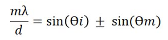
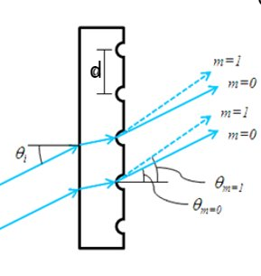
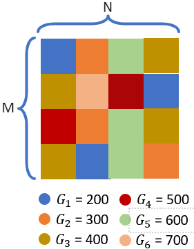

# Grating_Modeling

A diffraction grating is an artificial periodic structure with a defined period 'd', which can be completely constant along
the grating surface or can change according to a particular polynomial law. The diffraction is related by:

Where m is the diffraction order, ϴi is the angle of incidence and ϴm is the angle of diffraction, and λ is the wavelength that should cover acertain wavelength range  400nm to 700nm. and can be graphically represented as

We propose a configuration with 6 different implementable gratings were chosen, with 200 to 700 grooves density (G) which will be randomly distributed spatially as shown in the figure

